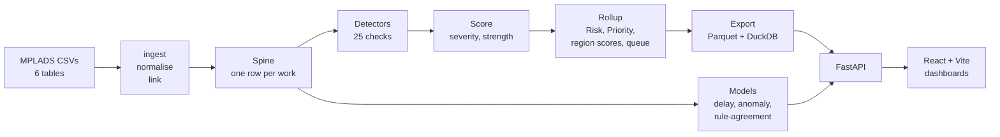

# MPLADS Ecosystem

An oversight and anomaly-detection platform for the **Members of Parliament Local Area Development Scheme (MPLADS)**, built for Smart India Hackathon problem statement **SIH26102**.

It reads every work recommended, sanctioned, completed and paid under MPLADS for the 17th and 18th Lok Sabha, flags works that need an official's attention, scores and ranks them, predicts which new works are likely to be delayed, and gives each level of government (MoSPI, State, District, Implementing Agency, MP) its own dashboard, map and review queue.

A flag means **"an official should look at this work"**. It never means fraud.

**Author:** Aaryan Jain

---

## Contents

- [What it does](#what-it-does)
- [Current numbers](#current-numbers)
- [Architecture](#architecture)
- [How risk is scored](#how-risk-is-scored)
- [Detectors](#detectors)
- [Machine-learning models](#machine-learning-models)
- [Dashboards and roles](#dashboards-and-roles)
- [Setup and running](#setup-and-running)
- [Configuration](#configuration)
- [API](#api)
- [Tests](#tests)
- [Project structure](#project-structure)
- [Source dataset](#source-dataset)
- [Known limitations](#known-limitations)

---

## What it does

- **25 rule-based and statistical detectors** (26 defined; one disabled) covering delays, money, guideline limits, duplication, concentration and record-keeping. Each finding carries its evidence: observed values, the threshold, the peer benchmark and the guideline source.
- **One risk engine** turns findings into a 0–100 Risk per work, a Priority per work (Risk scaled by the money at stake) and a risk score per state, district, constituency and agency.
- **A review queue** of the top 2,000 18th Lok Sabha works by Priority, each routed to the desk responsible for that stage (recommendation, sanction, execution, payment).
- **A pre-sanction delay predictor** that estimates, on the day a work is recommended, how likely it is to be seriously delayed, with the reasons behind each prediction.
- **Case files** for every work: its lifecycle timeline, findings with evidence, the AI assessment, and a discussion thread with internal notes and attachments.
- **A reviewer feedback loop.** Officers mark findings Verified, Dismissed or Under investigation. Tags that reviewers keep rejecting lose "high" severity, and patterns they keep dismissing are suppressed automatically.
- **Choropleth maps** from India down to state, district and constituency, and **PDF reports** at every level.
- **An alert digest** of new high-severity findings after each pipeline run.
- **9 languages:** English, Hindi, Bengali, Tamil, Telugu, Marathi, Gujarati, Kannada and Malayalam.
- **Only real data.** Every number on a dashboard comes from the source records or from the engine's own calculations. A value that can't be computed shows as "—", never a stand-in number.

## Current numbers

Data snapshot of 10 September 2026:

| | |
|---|---:|
| Works in scope (17th + 18th Lok Sabha) | 202,766 |
| Findings | 96,493 |
| Works with at least one finding | 84,139 |
| Works flagged for review (substantive findings, both terms) | 59,907 |
| 18th Lok Sabha works flagged | 18,924 of 1,07,971 |
| Review queue | 2,000 works (1.85% of 18th Lok Sabha works) |
| Delay model AUC, tested forward in time | 0.734 |

## Architecture



- **Pipeline** (`engine/`, Python): ingest → normalise → link → detectors → score → rollup → export → alerts → validation → model training. Run with `python -m engine.run_pipeline`; it takes about 2 minutes.
- **API** (`api/`, FastAPI): loads the pipeline's outputs into memory once and serves 33 endpoints behind role-based sign-in.
- **Frontend** (`web/`, React 19 + Vite + Leaflet): the dashboards, maps, case files and reports.

## How risk is scored

The full list of formulas is in the project's formulas page. In short:

1. **Severity score per finding.** Each detector gives a finding a continuous score x from 0 to 1: how far past its threshold the work is. Examples are the peer percentile of a delay, how many times past a fixed limit it is, or the robust z-score of its cost. The labels are bands of x: low below 0.3333, medium up to 0.6667, high above.
2. **Severity policy.**
   - Statistical findings are capped at medium by compressing their scores, not clipping them, so their order is kept.
   - A work with findings in two or more families has its strongest statistical finding raised one band.
   - Officer reviews can cap or suppress tags that turn out to be unreliable.
3. **Strength of each finding:** `s = curve(x) × confidence`. The curve runs through (0, 0.10), (1/6, 0.15), (1/2, 0.35), (5/6, 0.60) and (1, 0.70). Confidence is 1.0 for rule findings and 0.6 for statistical ones. Data-entry findings are capped at 0.05.
4. **Risk of each work (0–100):** `Risk = 100 × [1 − Π (1 − strongest s per family)]`. Families are timing, money, guideline, concentration, documentation and data integrity. Correlated findings in one family don't stack.
5. **Priority:** `Priority = Risk × (0.5 + 0.5 × E)`, where `E = clip(log₁₀(amount ÷ ₹1 lakh) ÷ 2, 0, 1)`, so money counts from ₹1 lakh up to ₹1 crore.
6. **Region risk score:** `risk_score = shrunk flagged rate × money-weighted Risk`.
   - `shrunk rate = (flagged + p₀·m) ÷ (works + m)`, where p₀ is the overall flagged rate.
   - The prior strength m is estimated from the data (empirical Bayes). It comes out at 80 for states, 7.4 for districts and 8.0 for constituencies.
   - Works whose only findings are missing documents or data-entry mismatches don't count as flagged here.

When the fixed-limit delay check and a peer-comparison delay check fire on the same delay, they become one finding with both pieces of evidence (11,561 merged).

## Detectors

| Family | Detectors |
|---|---|
| Timing | Delay in Sanction, Recommendation Pending Sanction, Sanctioned Work Not Taken Up, Delay in Completion, Work Not Completed, Payment Without Completion, Prolonged Delay Beyond Guideline (3 fixed-limit checks) |
| Money | Excess Expenditure, Sanction Exceeds Recommendation, Expenditure Without Sanction, Expenditure After Completion, Unusual Cost, Payment and Completion Mismatch, Duplicate Work, Same Work Recommended by Multiple MPs |
| Guideline | Prohibited Work, Trust/Society Limit Exceeded, Allocation Limit Exceeded, Unspent Balance, SC/ST Earmark Shortfall (disabled: the data can't support it yet) |
| Concentration | Concentration of Works in a Single Agency |
| Documentation | Completion Evidence Not Attached, Calamity Consent Discrepancy |
| Data integrity | Record Date Discrepancy |

- **Peer-comparison delay checks** compare each work with works of the same state, activity and term. They fall back to state and term, then to term alone, when a group has fewer than 30 works. A work is flagged above max(peer 90th percentile, a fixed floor).
- **Fixed-limit checks** flag any work past 365 days to sanction, 365 days unsanctioned, or 540 days open, however slow its peers are.
- **Unusual Cost** uses a robust z-score of log cost within state × activity × term.

Every threshold lives in `config/detectors.yaml`. Anything not yet confirmed against the guideline text is marked `verified: false`.

## Machine-learning models

None of these creates, removes or regrades a flag.

| Model | What it answers | Evaluation |
|---|---|---|
| **Delay predictor** (`engine/predictive.py`) | How likely a work is to be seriously delayed, as of the day it is recommended | AUC 0.731 on unseen constituencies, 0.734 trained on older works and tested on newer ones. The riskiest 10% were actually delayed 69% of the time, against a 36% base rate. |
| **Anomaly score** (`engine/risk_model.py`) | How unusual a work looks compared with works at the same lifecycle stage and cost | Reorders the queue only within 5-point Priority bands |
| **Rule-agreement score** (`engine/risk_model.py`) | How closely a work resembles works the rules graded high | AUC 0.981. This measures agreement with the rules, not real-world risk, so it is shown only as context. |
| **Reviewer-label model** (`engine/risk_model.py`) | Learns from officers' Verified/Dismissed verdicts | Trains automatically once 300 reviews exist |

**Delay predictor details**

- **Training data:** 90,838 17th Lok Sabha works recommended from 1 April 2023, the date MPLADS moved to the eSAKSHI portal. Earlier records hold only the unfinished works carried over, all of them delayed, so they would bias the model.
- **Label:** delayed if the sanction lag is above 382 days or the execution lag above 702 days (the 90th percentiles), or if the work has already waited longer than that. Works too young to judge are left out.
- **12 inputs, all known on the recommendation date:**
  - amount, and cost compared with similar works in the same state and activity
  - description length
  - month, quarter, and whether it falls in the January–March year-end window
  - how common its activity, state and district are
  - how many works came in the same recommendation letter
  - how many works the MP recommended in the previous 30 days
  - how many works the district authority received in the previous 90 days
- **Model:** gradient-boosted trees (600 trees, learning rate 0.05) with isotonic calibration, so a probability of 0.64 means about 64% of such works were delayed.
- **Tiers:** High is the riskiest 10% of past works (69% of them were delayed), Medium the next 30% (52%), Low the rest (23%).
- **Reasons:** each prediction lists up to three reasons, taken from the model's own importance ranking and this work's percentile on each input.

## Dashboards and roles

Sign-in is one shared password per role. The user name is the role id; State, District, Agency and MP users then pick their own entity.

| Role | Sees |
|---|---|
| MoSPI | National overview, India map, all anomalies, MP audits, reports |
| State Nodal Authority | Its state's overview, constituency map and district drill-down (it can switch districts from the map) |
| District Authority | Its district's scorecard, map, agencies and queue |
| Implementing Agency | Its own works and findings |
| Member of Parliament | Its constituency's works, "under review" items and map |

Every dashboard has:
- a Lok Sabha term switch and a date-range filter
- KPI cards with hover explanations
- charts of the project lifecycle, findings by tag and works by pipeline stage
- a PDF report button

The map pages add choropleths and scorecards with an Amount/Projects toggle, and the same hover explanations.

Demo passwords are in `config/auth.yaml`: `mospi-2026`, `state-2026`, `district-2026`, `agency-2026`, `mp-2026`. Change them, and remove the credentials table from the sign-in page, before any real use.

## Setup and running

**Prerequisites:** Python 3.12+ (tested on 3.14) and Node.js 20+ (tested on 24).

1. **Get the data.**
   - The six source CSVs sit in the repository root. `mplads_fetch.py` refetches them.
   - Place Datameet's 2019 parliamentary-constituency boundaries at `data/geo/india_pc_2019_simplified.geojson`.

2. **Configure secrets.** Copy `.env.example` to `.env`.
   - Set `AUTH_SECRET` to any random string. The API refuses to start without it.
   - `OPENROUTER_API_KEY` is optional. It only enables the written case-file narrative.

3. **Install the backend.**
   ```bash
   python -m venv .venv
   .venv\Scripts\activate          # Windows  (source .venv/bin/activate on macOS/Linux)
   pip install -r requirements.txt
   ```

4. **Run the pipeline and build the map files.**
   ```bash
   python -m engine.run_pipeline    # ~2 min: findings, scores, rollups, models
   python -m engine.geo_crosswalk   # constituency ↔ map-boundary crosswalk
   python -m engine.geo_dissolve    # state and district boundaries
   ```
   On Windows, set `PYTHONUTF8=1` first.

5. **Start the API.**
   ```bash
   uvicorn api.main:app --host 127.0.0.1 --port 8000
   ```

6. **Start the frontend.**
   ```bash
   cd web
   npm install
   npm run dev                      # http://localhost:5173
   ```

To put it online, see [deploy/oracle/README.md](deploy/oracle/README.md) (Oracle Cloud Always Free, one server with HTTPS).

## Configuration

| File | Holds |
|---|---|
| `config/detectors.yaml` | Every detector threshold, the scoring curve and weights, reviewer-feedback rules, queue size and materiality floor, region shrinkage, and model settings (`models:`) |
| `config/tags.yaml` | Tag names, families and guideline sources |
| `config/routing.yaml` | Which desk each lifecycle stage's findings go to |
| `config/auth.yaml` | Role passwords (demo); `AUTH_PASSWORD_<ROLE>` in `.env` overrides one |
| `.env` | `AUTH_SECRET`, `OPENROUTER_API_KEY`, optional `AUTH_PASSWORD_<ROLE>` and `CORS_ORIGINS` (comma-separated; defaults to the Vite dev server) (gitignored) |
| `web/.env.production` | Optional `VITE_HIDE_DEMO_CREDENTIALS=true` to build without the sign-in page's demo-password table |

## API

All data endpoints need a bearer token from `POST /api/auth/login`. The national endpoints (funnel, analytics, queue, states, MPs, agencies) are MoSPI-only; every other role gets only its own state, district, seat or agency. Signing in to a role other than MoSPI first returns a 10-minute picker token that reads only that role's pick list. Five wrong passwords for a role lock it for 5 minutes from that address.

| Area | Endpoints |
|---|---|
| Sign-in and meta | `POST /api/auth/login`, `GET /api/meta` |
| National | `GET /api/funnel`, `GET /api/analytics`, `GET /api/states`, `GET /api/constituencies` |
| Drill-downs | `GET /api/state/{state}`, `GET /api/districts`, `GET /api/district/{state}/{district}`, `GET /api/constituency/{id}`, `GET /api/mps`, `GET /api/mp/{name}`, `GET /api/agencies`, `GET /api/agency/{name}` |
| Queue and works | `GET /api/queue`, `GET /api/work/{n}`, `GET /api/work/{n}/ai_assessment`, `POST /api/predict_risk` |
| Review | `GET /api/findings/status`, `POST /api/findings/{id}/status`, `GET /api/alerts/latest` |
| Discussion | `GET/POST /api/comments`, `PATCH/DELETE /api/comments/{id}`, `POST /api/comments/{id}/attachments`, `GET /api/comments/{id}/attachments/{aid}` |
| Reports | `GET/POST /api/reports`, `DELETE /api/reports/{id}`, `GET /api/reports/{id}/pdf` |
| Other | `POST /api/narrative`, `POST /api/translate` |

## Tests

```bash
pytest tests
```

There are 53 tests:
- one per detector, each with a case that must not flag
- the severity policy, strength curve, Risk, Priority and region shrinkage
- the delay model's labels and inputs, including checks that no feature reads information from after the recommendation date

The frontend has one test, which checks that every string exists in all 9 languages with its `{placeholders}` intact:

```bash
cd web
npm test
```

## Project structure

```
api/                 FastAPI app: endpoints, auth, comments, finding status, reports, translation
config/              detectors.yaml, tags.yaml, routing.yaml, auth.yaml
docs/                SCHEMA.md (pipeline schema and data notes), risk scoring formulas and simple guide (PDF)
engine/
  ingest.py … link.py      Load, clean and join the six tables into one spine
  detectors.py             The 25 detectors and the delay-lane merge
  severity.py              Shared continuous severity scale
  score.py                 Severity policy, strength, per-finding priority, routing
  rollup.py                Work Risk and Priority, region scores, review queue
  predictive.py            Pre-sanction delay predictor
  risk_model.py            Anomaly score, rule-agreement and reviewer-label models
  explain.py               Model-derived reasons shared by both models
  validation.py            Reviewer feedback, regression check, hand-check sheet
  export.py, alerts.py     Parquet/DuckDB export, alert digest
  report.py                Before/after detector report and the list of unverified config values
  geo_*.py                 Map boundaries: constituency crosswalk, state and district shapes, state-name matching
  run_pipeline.py          Runs everything in order
tests/               pytest suite
web/                 React + Vite frontend (views/, components/, strings.js for the 9 languages)
reports/             Hand-check sheet, detector before/after report, config values still to verify
mplads_fetch.py      Fetches the source tables from the MPLADS dashboard API
console_works_sanctioned.js   Browser-console fallback that fetches Works Sanctioned for both Lok Sabhas
```

---

## Source dataset

A complete extract of all six tables behind the MPLADS public dashboard (<https://mplads.mospi.gov.in/digigov/dashboard.html>), Ministry of Statistics and Programme Implementation, Government of India. **Snapshot:** 10 September 2026, about 00:15–01:20 IST.

The CSVs are the full original fetch (Lok Sabha and Rajya Sabha, all four scopes) and are kept as-is for provenance. The pipeline and dashboards cover only the **17th and 18th Lok Sabha**; Rajya Sabha rows are dropped at ingest (`engine/ingest.py`).

**Why the fetch exists.** The dashboard's own CSV export fails in the browser. Each table is one un-paginated JSON response of up to about 110 MB that takes 60–200 s, and the page gives up on it. Fetched server-side with a long timeout, the same endpoint works:

    POST /rest/PreLoginDashboardData/getTilesReportData
    {"combo": "<state>,<constituency>,<mp>,<house>[,<tenure>]", "key": "<tile name>"}

`0` = All. `house`: `2` Lok Sabha, `1` Rajya Sabha. `tenure`: `7` 18th LS, `5` 17th LS, `1` RS Sitting, `2` RS Retired.

| File | Records | Amount column |
|---|---:|---|
| `works_recommended.csv` | 254,534 | `RECOMMENDED_AMOUNT` |
| `expenditure_on_completed_and_on_going_works_as_on_date.csv` | 279,739 | `FUND_DISBURSED_AMT` |
| `works_sanctioned.csv` | 216,310 | `SANCTION_AMOUNT` |
| `works_completed.csv` | 133,046 | `ACTUAL_AMOUNT` |
| `allocated_limit_for_hon_ble_mps.csv` | 1,566 | `ALLOCATED_AMT` |
| `amount_consented_for_calamity.csv` | 33 | `CONSENTED_AMOUNT` |
| `_totals.csv` | 32 | grand totals for validation |
| **Total** | **885,228** | |

**Provenance.** Every field value is verbatim from the API. Exactly two columns were added:
- `SCOPE_HOUSE`: the house queried
- `SCOPE_TENURE`: the tenure filter queried

`SCOPE_TENURE` is not the native `TENURE` field. For Rajya Sabha, `TENURE` means elected or nominated. All amounts are in rupees.

**Caveats**
- `WORK_DESCRIPTION` contains embedded newlines, so use a real CSV parser.
- `Total_Amt` is blank on data rows. Its grand-total rows were moved to `_totals.csv`.
- Files are UTF-8 with a BOM.
- The source database is live, so row counts drift between calls.

**Validation.** Record counts and `sum(amount)` match the dashboard in 23 of 24 scopes. The exception is `works_recommended` / 17th Lok Sabha: 94,745 records captured against 94,754 live. The captured rows sum exactly to that payload's own total, so those 9 works were added after the snapshot.

## Known limitations

- **Flag precision hasn't been measured yet.** `reports/hand_check_sheet.csv` holds 200 findings to label. The reviewer feedback loop and the reviewer-label model switch on as reviews come in.
- **Some delay-model inputs matter little.** Recommendation quarter and the year-end window contribute almost nothing; the delay model is close to what this data allows at recommendation time.
- **Unconfirmed thresholds.** Guideline thresholds marked `verified: false` in `config/detectors.yaml` haven't been confirmed against the 2023 guideline text.
- **Out-of-term recommendation dates.** Some 17th Lok Sabha works have recommendation dates in 2025–2026, after that term ended. That is how they appear in the source data.
